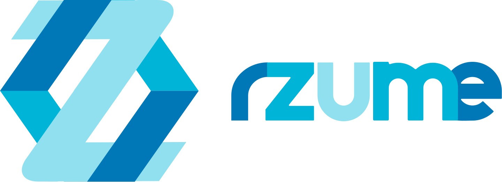

## Theme
### CORPORATE SECTOR:
In this fast and quick world ,getting your resumes acustomedly designed for each and every job
manually is not feasible and very time consuming .Let’s take an example: A person who has a
past experience as a teacher(say social science) and also a part time software developer.
Now take a situation that person has applied for a post at school for a position of primary class
social science teacher.To get this job he/she needs a strong CV showing off their skills and
education in the background of social science,whereas if he/she applies for the post of
SDK1(Software Developer) the point of emphasising their skills in the field of Social science
won’t make a difference,vis-a-vi a stronghold skills in the field of software development will
increase their chance to get the job.
So an all in one platform that would provide you a custom made CV based on your skill set and
emphasise your skills required as per the job would be really helpful to a job seeking person.
  
 
# Rzume

<h1 align="center">The ultimate tool for an exceptional resume.</h1>
<h5 align="center">Create nothing but the best with us.</h5>

  

## Features &nbsp;&nbsp; :page_with_curl:

### Professional templates
* Pick one from our many attractive templates, fill in your skills and experiences and you are all set to go. Our completely customizable designs allow you to change font, colors, layout and images, making it a reflection of you, with great ease.

### Completely secure
* Create your resume without any of the usual hassle of signing up and creating an account. We do not save your data and your privacy is absolutely guaranteed.

 

## Usage  &nbsp;&nbsp; :scroll:

### Choose your template
* Take your pick from our beautiful templates that are designed to impress. You can personalize it and give it your own unique touch.

### Fill in your details
* Fill in your skills, previous experiences and educational qualifications.

### Download PDF
* Download the remarkable resume you have created and send it to your potential employers with confidence.
  

## Packages Used &nbsp;&nbsp; :package:

| Client Side Packages  |
| :-------------: |
| @material-ui/core  |
| @material-ui/icons  |
| @react-pdf/renderer |
| image-to-base64  |
| react-color |
| react-helmet  |
| react-hook-form |
| react-icons  |
| react-reveal |
| react-router-dom  |
| react-slick  |
| react-to-pdf |
| slick-carousel |

  

### Upcoming Features &nbsp;&nbsp; 
* More templates
* Advanced customizations
* Awards field

    

#### Found a bug? Create an issue.

  

  
